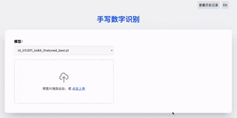

# Learn-MNIST-Deeply

## 🎞️ Demo



## 📖 Introduction

This project is a simple yet comprehensive set of experiments based on the MNIST dataset. It implements four key functions:

- Performance comparison of various CNN architectures
- Hyperparameter and regularization experiments based on the LeNet model
- Transfer learning experiments using a custom dataset
- A lightweight frontend-backend system for model inference and visualization

## 📁 Project Structure

```bash
Learn-MNIST-Deeply/
├── app.py                  # Entry point for the frontend 
├── train.py                # Main script for training models
├── utils.py                # Utility functions
│
├── models/                 # Definition of model architectures
│   ├── lenet.py
│   ├── resnet.py
│   ├── mobilenet.py
│   ├── densenet.py
│   ├── vgg.py
│   ├── vit.py
│   └── base_model.py
│
├── Param_Comparison/       # Hyperparameter & regularization experiments
├── TransferLearning/       # Transfer learning using a custom dataset
├── Visualization/          # Confusion matrix plotting
│
├── checkpoints/            # Saved model weights
├── data/                   # MNIST dataset
│
├── static/                 # Frontend static files
├── templates/              # Frontend HTML templates
└── README.md
```

## 🚀 Quick Start

```bash
git clone https://github.com/ic1fy/Learn-MNIST-Deeply.git
cd Learn-MNIST-Deeply
```

## 🧠 Model Training

Use `train.py` to train any supported model on the MNIST dataset.

```bash
python train.py --model lenet --lr 0.001 --batch_size 64 --epochs 20
```

## ⚙️ Param Tuning & Regularization

Use `Param_Comparison/` to run LeNet-based hyperparameter comparison and regularization experiments.

```bash
# Run hyperparameter comparison experiment
python -m Param_Comparison.param_effect_analysis

# Run regularization experiment
python -m Param_Comparison.param_effect_regularization
```

## 🔁 Transfer Learning

Use `TransferLearning/` to fine-tune pretrained models on a custom dataset.

```bash
python -m TransferLearning.fine_tuning --model lenet --weights checkpoints/lenet_lr0.001_bs64.pt
```

## 🌐 Frontend & Inference

Use `app.py` to launch a simple web interface for model inference and visualization.

```bash
python app.py
```

Then open your browser and visit:

```
http://127.0.0.1:5000
```

## 🙋 Author & Acknowledgements

This project was developed by **Chenlei Li**
as part of the **Comprehensive Course Design (Short Semester)** at **Hangzhou Dianzi University**.

Special thanks to the instructors and classmates for their support and feedback.
